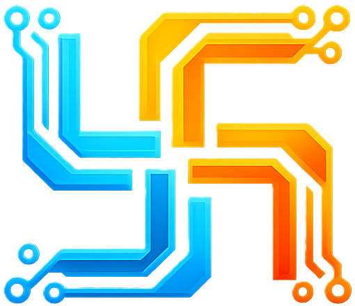

<p align="center">
  
</p>

# Nux Language

Nux is a universal, highly portable systems programming language designed to run anywhere — from ancient 8-bit microcontrollers to modern 64-bit multi-core processors — without modification. Built with a focus on speed, cross-hardware compatibility, and modern developer ergonomics, Nux bridges the gap between high-level ease of use and low-level hardware control.

## Features

- **Universal Portability**: Write once, run anywhere. The Nux MicroVM allows code to execute natively on almost any architecture.
- **CUG Concept (Create and Use as Go)**: Nux makes it trivial to write drivers and libraries for unknown or legacy hardware in hours instead of months.
- **Hardware Glue (`.nuxg`)**: Abstract away hardware specifics using `.nuxg` files. Define custom registers, link hardware-specific libraries, and map physical memory dynamically using `@hardware("Name")`.
- **Nux Environments (`.nuxenv`)**: Python-style virtual environments for Nux. Isolate your project dependencies, libraries, and compilation caches automatically.
- **JIT & AOT Compilation**: Compile directly to optimized MicroVM bytecode (`.nuxi`) or leverage the tier-based execution model.
- **Pure Nux Standard Library**: Includes built-in `std` libraries (`math`, `memory`, `io`) written entirely in pure Nux, zero external dependencies required. Optimized for safety and portability.

## Installation

### Quick Install (Linux, macOS, BSD)

The easiest way to install Nux is via the official installation script:

```bash
curl -fsSL https://raw.githubusercontent.com/DoguparthiAakash/Nux_Lang/main/install.sh | sh
```
*(Note: If Nux is already installed, this script will pause and interactively ask if you want to Update, Repair, or perform a Fresh Install.)*

### Package Managers (Linux)
Pre-compiled packages for Debian/Ubuntu (`.deb`) and Fedora/RHEL (`.rpm`) are available.
```bash
# Debian/Ubuntu
sudo dpkg -i nux_<version>_amd64.deb

# Fedora/RHEL
sudo rpm -i nux-<version>.x86_64.rpm
```

### Build from Source
Ensure you have the Rust toolchain installed:
```bash
git clone https://github.com/DoguparthiAakash/Nux_Lang.git
cd Nux_Lang
./install.sh
```

### Updating Nux
You can update your Nux installation instantly to the latest version by running:
```bash
nux update
```

### Uninstallation
You can cleanly remove Nux and all its environments using the uninstallation script:
```bash
curl -fsSL https://raw.githubusercontent.com/DoguparthiAakash/Nux_Lang/main/uninstall.sh | sh
```
*(Alternatively, you can run `nux uninstall` if Nux is already in your PATH.)*

## Quick Start

### 1. Initialize a Project
Create a new Nux project and its isolated environment:
```bash
nux init my-project
cd my-project
nux venv
```
This creates a `nux.toml` configuration, a basic `main.nux` file, and a `board.nuxg` hardware file.

### 2. Configure Hardware (`board.nuxg`)
Hardware bindings are defined in `.nuxg` files:
```nux
@hardware("CustomBoard_v1")

# Map a hardware register easily
register(0x40020000) as GPIO_PORTA

# Link hardware libraries
link "lib/gpio.nuxel"
```

### 3. Write Code (`main.nux`)
```nux
import "board.nuxg";
import "std/io";

func main() {
    print("Hello from Nux on CustomBoard_v1!");
}

main();
```

### 4. Run
```bash
nux run main.nux
```

## License
MIT License
